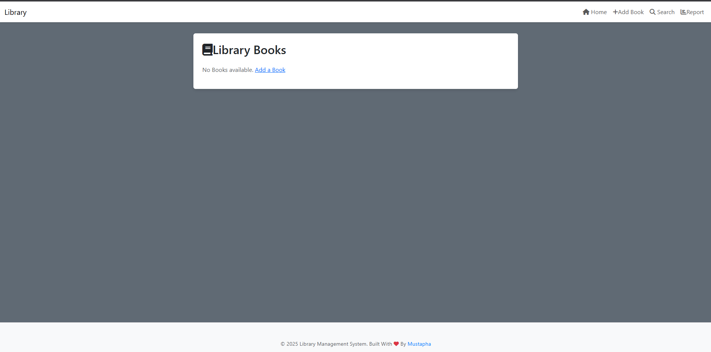
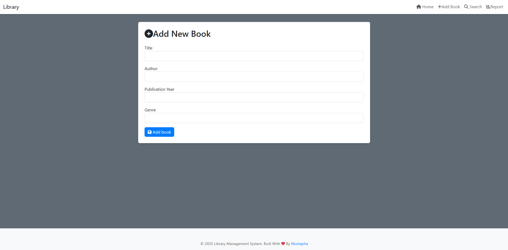
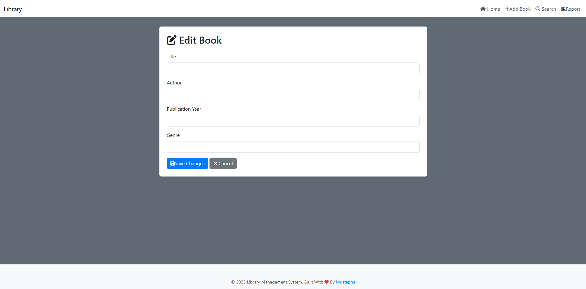
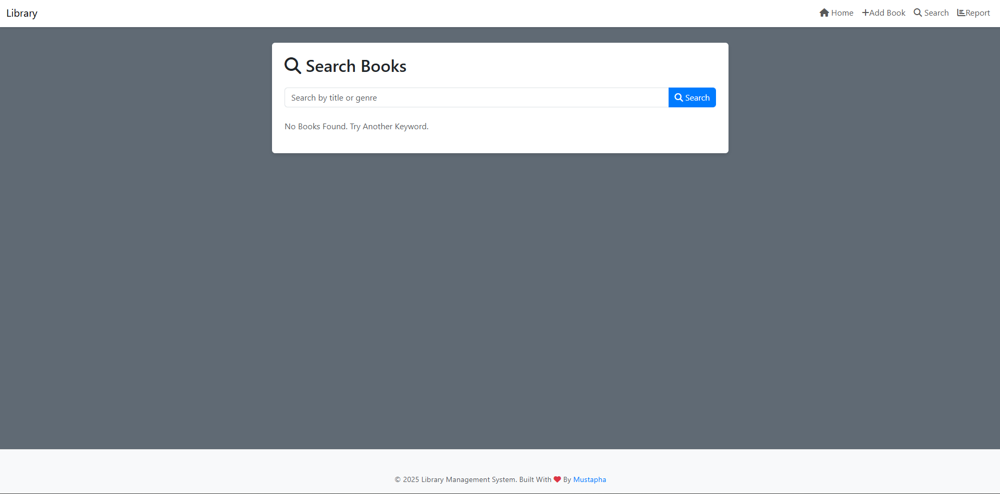
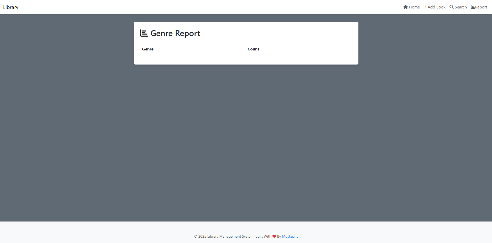

# Library Management System

A web-based application for managing books, built with **Python**, **Flask**, **MySQL**, **Pandas**, and **Bootstrap**. This project demonstrates skills in web development, database management, data analysis, and responsive UI design.

## Features
- Add, edit, and delete books with a user-friendly interface.
- Search books by title or genre.
- Generate genre-based reports with Pandas (visualized with Chart.js, optional).
- Responsive and minimal UI built with Bootstrap.

## Tech Stack
- **Backend**: Flask, Python
- **Database**: MySQL
- **Data Analysis**: Pandas
- **Frontend**: Bootstrap, HTML, CSS
- **Charting**: Chart.js (optional)

## Screenshots







## Installation
1. Clone the repository:
   ```bash
   git clone https://github.com/petrichor00i/library-management-system.git